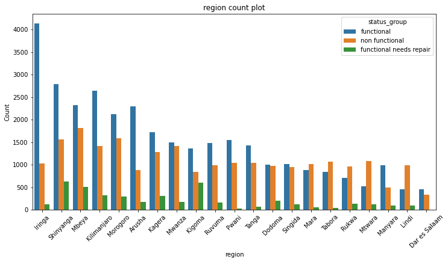
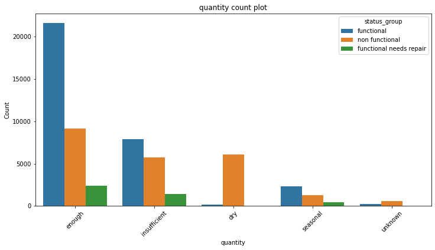

# Tanzania-Water-wells-Project
"C:\Users\Calvine Mugunda\Documents\Tanzania-Water-wells-Project\Well_IMAGE1.jpeg"

 ## <li> **Business Understanding**
Tanzania faces a water crisis due to limited infrastructure, uneven distribution, poor water quality, climate change, and population growth. We are working on a project that utilizes machine learning to predict well success, optimize resource allocation, and ultimately break the cycle of water insecurity and poverty.

## <li> **Project Goal**
Our goal in this project is to utilize machine learning algarithms to build a model predicting water point functionality in Tanzania. This empowers Tanzanian authorities to identify wells needing maintenance, guide future well placement for better success rates, and ultimately optimize water resource management across the country. By predicting well functionality, the model can help target limited resources for repairs, inform data-driven decisions on new well construction, and promote efficient water utilization, tackling Tanzania's water crisis head-on.

## <li> **Data Understanding**
This project utilizes data from the Tanzanian Ministry of Water (https://www.drivendata.org/competitions/7/pump-it-up-data-mining-the-water-table/page/25/)  provided in three CSV files: training set values (well features), training set labels (actual well functionality), and test set values (features for wells where functionality needs prediction). Our goal is to build a machine learning model using the training data to predict the functionality (functional, non-functional, needs repair) of wells in the test set.

#### Data Exploration Revealed Key Insights
Our initial analysis revealed valuable insights about the Tanzanian water point data. The dataset contains 59,400 entries for water points, described by 41 features (10 numerical, 31 categorical). Importantly, after examining the data structure and content, we identified 21 redundant features providing the same information. These features were removed to streamline the data and optimize our model development process.

#### Steps to follow
we will use **OSEMN** framework and this are the seps:

*Obtain
*Scrub
*Explore
*Model
*Interpret

## <LI> Tech Stack

* Python
* Pandas
* Matplotlib
* Seaborn
* Scikit-Learn

## <li> **Data Preposing and Analysis**

#### Data Preparation(cleaning)

This phase focuses on preparing the data for analysis. We'll identify and address missing values, duplicate entries, inconsistencies, and invalid data. Since we already identified irrelevant features during data exploration, we'll begin by removing those columns to streamline the cleaning process and optimize our model development.

## <li> Exploratory Data Analysis

Exploring the Data: Unveiling Patterns and Relationships

We will delve into understanding the data. We'll employ visualization techniques and statistical analysis (univariate and bivariate) to uncover trends, patterns, and relationships between the different variables. This exploration will shed light on how individual features behave (univariate) and how they interact with each other (bivariate), providing valuable insights for our model building process.

 regional variations in factors like water quality, climate, or infrastructure influencing the functionality of waterpoint pumps.

correlation between the amount of water available at a waterpoint and the functionality of its pump.

#### EDA conclusion
Water Availability Matters: Analysis reveals a clear link between water availability and pump functionality. Areas with sufficient water have more functional pumps. This highlights the importance of addressing water scarcity to ensure well functionality.

Regional Insights & Targeted Actions: We found regional variations. Some areas have more functional pumps, while others have more non-functional ones needing repair. The analysis also suggests a link between water hardness and pump wear. These findings can guide Tanzanian authorities:

Prioritize water conservation in regions with low water availability.
Implement targeted maintenance programs in areas with many non-functional pumps.
Investigate the link between water hardness and pump materials for future well construction.
This focuses on the key findings and actionable recommendations for the Tanzanian government.

## <li> Modeling
* To prepare our data to machine learning, we did some feature engineering, encoding and scaling.

* While other models achieved higher individual accuracy scores, our analysis prioritized the **KNeighborsClassifier** for its well-generalized performance (71% accuracy on unseen data). This model excels at avoiding overfitting, a crucial factor for reliable predictions on new well data.

## <li> Findings
* Water Quality: Soft water pumps tend to be more functional.
* Water Availability: Waterpoints with sufficient water are most functional.

* Regional Disparity:

1. Iringa, Kilimanjaro, and Shinyanga have the most functional pumps.
2. Kilimanjaro and Mbeya have the most non-functional pumps.
3. Kigoma has the most waterpoints needing repair.

* Water Source:

1. Springs and shallow wells have the most functional pumps.
2. Springs have the most frequently repaired functional pumps.
3. Shallow wells and boreholes have the most non-functional pumps.

* Water Scarcity: Waterpoints with insufficient water have very few functional pumps.

## <li> Recommendations

* Prioritize Springs: Build new waterpoints near springs whenever possible to extend pump life.
* Monitor Abundant Sources: Keep a close eye on high-water table wells to prevent overuse and pump failure.

## <li> Next step

Continuously improve the model for well pump prediction to optimize maintenance resource allocation.

